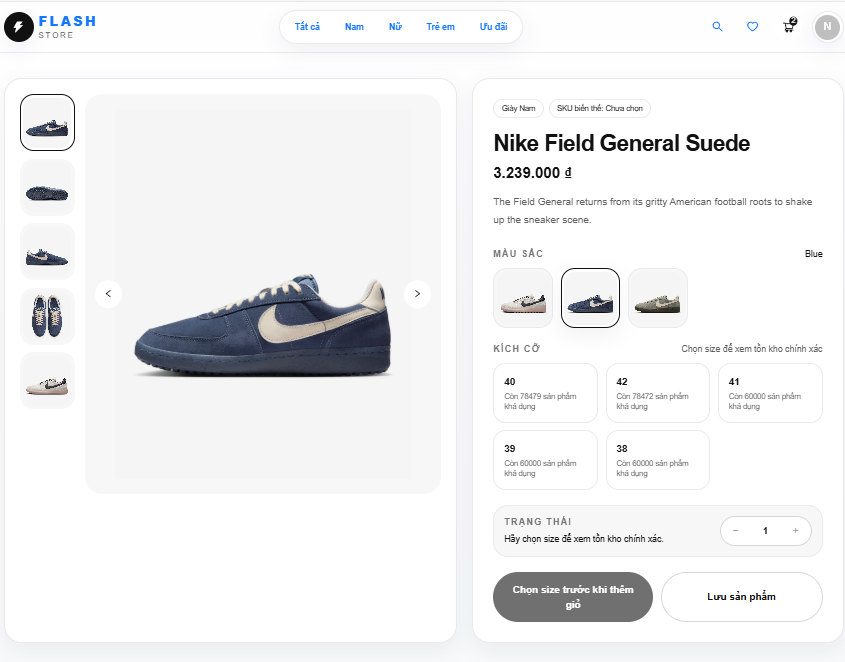
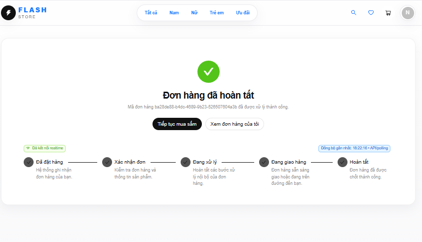
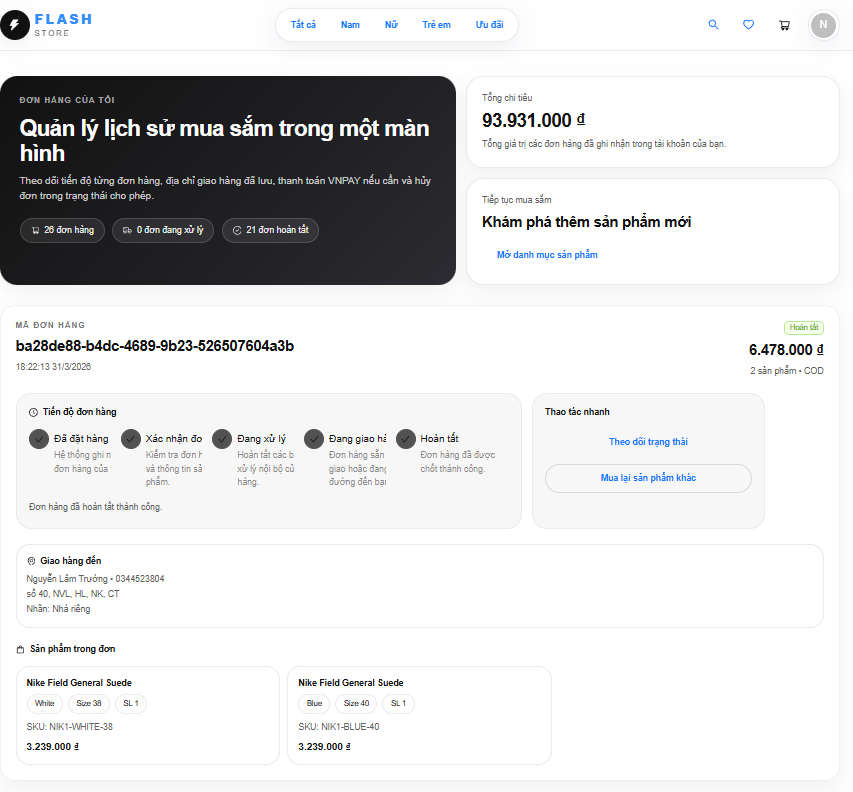

# Ecommerce Frontend

Frontend cho bài test tải của hệ thống bán hàng. Mục tiêu chính của repo này không phải mô phỏng một website ecommerce đầy đủ tính năng, mà là cung cấp giao diện để chạy và quan sát kịch bản **oversell**: nhiều người cùng truy cập, tranh mua cùng một SKU và đặt hàng gần như đồng thời.

## Chức năng chính

### Khách hàng
- Xem danh sách sản phẩm và lọc theo từ khóa, danh mục
- Xem chi tiết sản phẩm, chọn màu, size và kiểm tra tồn kho theo biến thể
- Đăng ký, đăng nhập tài khoản
- Thêm sản phẩm vào giỏ hàng, chỉnh số lượng và đặt hàng, hủy đơn
- Chọn địa chỉ giao hàng trước khi tạo đơn
- Chọn phương thức thanh toán COD hoặc VNPAY khi đặt hàng
- Theo dõi trạng thái đơn hàng qua trang đơn hàng và màn hình chờ xử lý
- Nhận cập nhật trạng thái đơn hàng theo thời gian thực qua WebSocket
### Admin
- Xem dashboard tổng quan với số lượng người dùng, số đơn hàng và doanh thu trong ngày
- Xem danh sách sản phẩm trong hệ thống
- Tạo sản phẩm mới, khai báo biến thể theo màu, size, giá, số lượng ban đầu và hình ảnh
- Chỉnh sửa thông tin sản phẩm và biến thể sản phẩm
- Xóa sản phẩm
- Xem danh sách đơn hàng và mở chi tiết từng đơn
- Xem danh sách người dùng trong hệ thống
- Khóa hoặc mở khóa tài khoản người dùng

## Công nghệ sử dụng

- Next.js 16 – xây dựng ứng dụng frontend 
- React 19 – phát triển giao diện theo component 
- TypeScript – hỗ trợ kiểm soát kiểu dữ liệu 
- Ant Design – dựng nhanh các màn hình quản trị và người dùng 
- TanStack Query – xử lý fetch, cache và đồng bộ dữ liệu 
- Axios – giao tiếp với REST API 
- Zustand – lưu state cục bộ như giỏ hàng, phiên làm việc 
- SockJS / STOMP – cập nhật trạng thái đơn hàng theo thời gian thực

## Cấu trúc chính

```text
src/
├─ app/                # các trang chính
├─ components/         # component giao diện
├─ services/           # gọi API
├─ lib/                # axios, helper
├─ store/              # state management
└─ types/              # kiểu dữ liệu
```

## Các màn hình chính

### Trang sản phẩm


### Trang chi tiết sản phẩm


### Trang giỏ hàng


### Trang đặt hàng


### Trang đơn hàng của người dùng


### Trang Admin


## Yêu cầu môi trường

- Node.js 20+
- npm 10+
- Backend API chạy tại `http://localhost:8000`
- WebSocket server chạy tại `http://localhost:8087/ws`

## Cách chạy local
### 1. Clone project
```bash
git clone https://github.com/truongnguyen3006/ecommerce-frontend-1-.git
cd <project-folder>
```

### 2. Cài dependencies

```bash
npm install
```

### 3. Tạo file môi trường

Tạo file `.env.local`:

```env
NEXT_PUBLIC_API_URL=http://localhost:8000
NEXT_PUBLIC_WS_URL=http://localhost:8087/ws
```

### 4. Chạy frontend

```bash
npm run dev
```

Frontend mặc định chạy tại:

```text
http://localhost:3001
```
Lưu ý: Backend cần được khởi động trước để frontend có thể gọi API và nhận cập nhật trạng thái đơn hàng qua WebSocket.

## Hạn chế hiện tại

- Chưa phải một website thương mại điện tử hoàn chỉnh
- Giao diện được giữ ở mức đủ dùng để phục vụ kiểm thử luồng đặt hàng và quan sát kết quả
- Trọng tâm của project nằm ở bài test oversell và xử lý đồng thời ở backend

## Tác giả

- **Tên:** Nguyễn Lâm Trường
- **Email:** lamtruongnguyen2004@gmail.com
- **GitHub:** [https://github.com/truongnguyen3006](https://github.com/truongnguyen3006)
