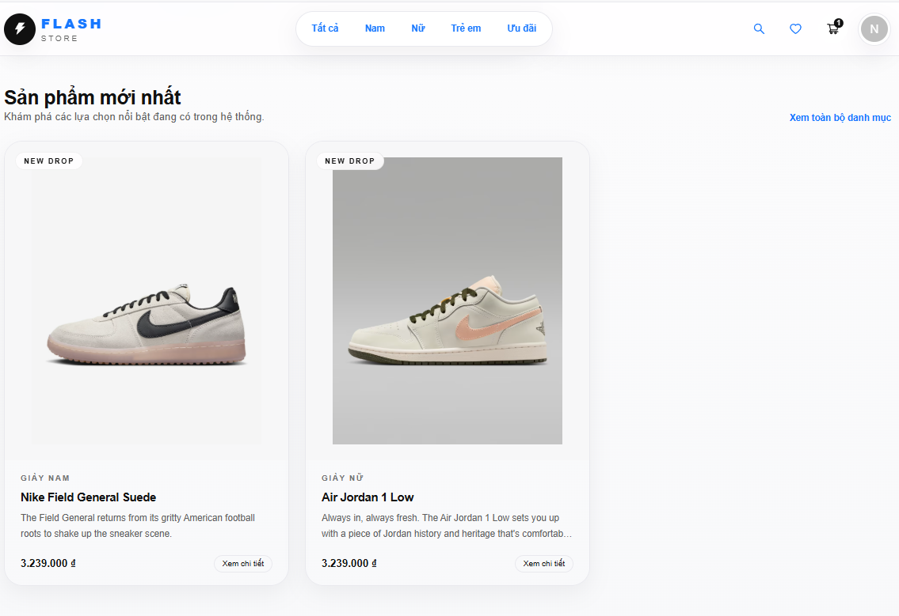
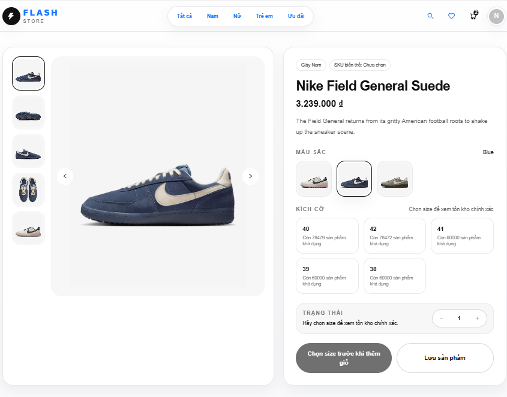
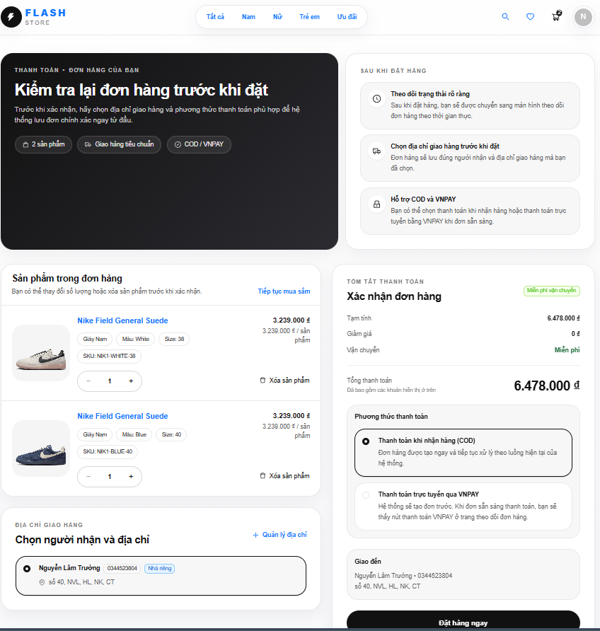
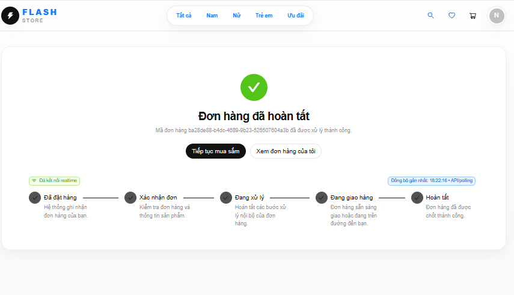
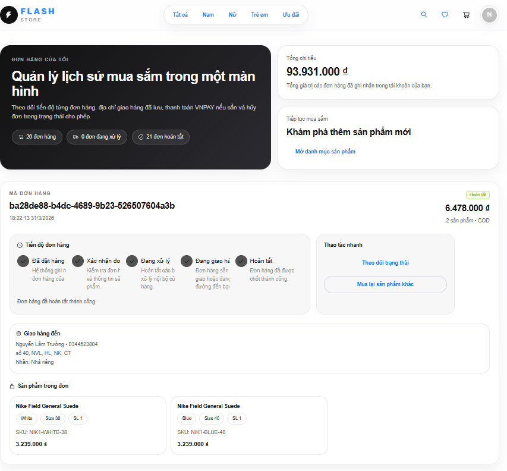
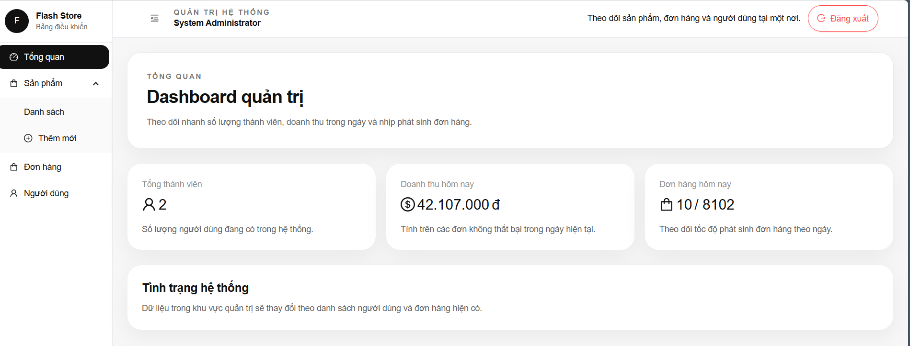

# High-Concurrency Ecommerce Frontend

> Giao diện Next.js cho hệ thống **High-Concurrency Ecommerce Microservices Backend**, phục vụ thao tác mua hàng, quản trị và quan sát kết quả của các luồng checkout.

Frontend này là giao diện đi kèm backend [ecommerce-backend-1-](https://github.com/truongnguyen3006/ecommerce-backend-1-.git). Trọng tâm của toàn bộ project nằm ở xử lý checkout đồng thời, kiểm soát oversell và đánh giá backend dưới tải cao.

> **Lưu ý:** frontend không phải công cụ tạo tải benchmark. Các kịch bản tải đồng thời được chạy bằng **JMeter** ở backend repo. Frontend chủ yếu dùng để thao tác thủ công, kiểm tra dữ liệu và quan sát kết quả sau khi hệ thống xử lý.

## Chức năng chính

### Khách hàng

- Xem danh sách sản phẩm và lọc theo từ khóa, danh mục.
- Xem chi tiết sản phẩm, chọn màu, size và kiểm tra tồn kho theo biến thể.
- Đăng ký, đăng nhập tài khoản.
- Thêm sản phẩm vào giỏ hàng, chỉnh số lượng, đặt hàng và hủy đơn.
- Chọn địa chỉ giao hàng trước khi tạo đơn.
- Chọn phương thức thanh toán COD hoặc VNPay khi đặt hàng.
- Theo dõi trạng thái đơn hàng qua trang đơn hàng và màn hình chờ xử lý.
- Nhận cập nhật trạng thái đơn hàng theo thời gian thực qua WebSocket.

### Admin

- Xem dashboard tổng quan với số lượng người dùng, đơn hàng và doanh thu trong ngày.
- Xem danh sách sản phẩm.
- Tạo sản phẩm mới với biến thể theo màu, size, giá, số lượng ban đầu và hình ảnh.
- Chỉnh sửa hoặc xóa sản phẩm và biến thể.
- Xem danh sách và chi tiết đơn hàng.
- Xem danh sách người dùng.
- Khóa hoặc mở khóa tài khoản người dùng.

## Công nghệ sử dụng

| Nhóm | Công nghệ |
|---|---|
| Framework | Next.js 16, React 19 |
| Ngôn ngữ | TypeScript |
| UI | Ant Design |
| Data fetching | Axios, TanStack Query |
| State management | Zustand |
| Realtime | SockJS, STOMP |

## Cấu trúc chính

```text
src/
├─ app/                # các trang chính
├─ components/         # component giao diện
├─ services/           # gọi API
├─ lib/                # axios, helper
├─ store/              # state management
└─ types/              # kiểu dữ liệu
```

## Các màn hình chính

### Trang sản phẩm



### Trang chi tiết sản phẩm



### Trang giỏ hàng



### Trang đặt hàng



### Trang đơn hàng của người dùng



### Trang Admin



## Yêu cầu môi trường

- Node.js 20+
- npm 10+
- Backend API chạy tại `http://localhost:8000`
- WebSocket server chạy tại `http://localhost:8087/ws`

## Cách chạy local

### 1. Clone project

```bash
git clone https://github.com/truongnguyen3006/ecommerce-frontend-1-.git
cd ecommerce-frontend-1-
```

### 2. Cài dependencies

```bash
npm install
```

### 3. Tạo file môi trường

Tạo file `.env.local`:

```env
NEXT_PUBLIC_API_URL=http://localhost:8000
NEXT_PUBLIC_WS_URL=http://localhost:8087/ws
```

### 4. Chạy frontend

```bash
npm run dev
```

Frontend mặc định chạy tại:

```text
http://localhost:3001
```

Backend cần được khởi động trước để frontend có thể gọi API và nhận cập nhật trạng thái đơn hàng qua WebSocket.

## Liên kết với backend benchmark

Các bài test **single-SKU oversell** và **multi-SKU concurrent ordering** được thực hiện bằng JMeter trong backend repo:

[ecommerce-backend-1-](https://github.com/truongnguyen3006/ecommerce-backend-1-.git)

Frontend có thể được dùng để kiểm tra trạng thái sản phẩm, tồn kho, đơn hàng và các kết quả nghiệp vụ sau khi benchmark hoàn tất.

## Hạn chế hiện tại

- Chưa phải một website thương mại điện tử hoàn chỉnh.
- Giao diện được giữ ở mức đủ dùng để phục vụ luồng mua hàng, quản trị và quan sát kết quả.
- Trọng tâm kỹ thuật chính của project nằm ở xử lý đồng thời, kiểm soát oversell và benchmark phía backend.
- Project phù hợp cho chạy local và portfolio/demo hơn là triển khai production ngay.

## Tác giả

- **Tên:** Nguyễn Lâm Trường
- **Email:** lamtruongnguyen2004@gmail.com
- **GitHub:** [https://github.com/truongnguyen3006](https://github.com/truongnguyen3006)
