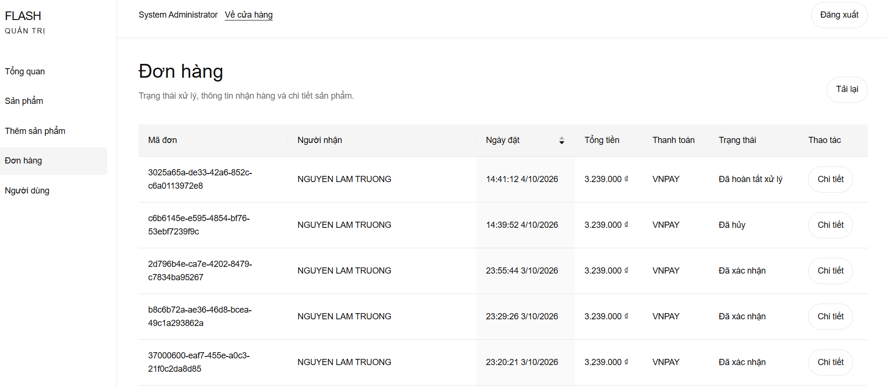

# Flash Store — Ecommerce Frontend

Frontend cho **Project 1 — Ecommerce Microservices**, xây dựng bằng **Next.js 16 + React 19 + TypeScript**.

Ứng dụng hỗ trợ catalog, authentication, cart, checkout, COD/VNPay, order tracking và các màn hình quản trị Product/Inventory/Order.

> Frontend đã qua lint, build và automated tests. Project chưa được deploy public production.

- [Backend repository](https://github.com/truongnguyen3006/ecommerce-backend-1-)
- Local frontend: `http://localhost:3001`
- API Gateway: `http://localhost:8080`

---

## Tính năng chính

- Search / filter / sort / pagination sản phẩm.
- Product detail theo variant, màu, size và tồn kho.
- Register / login / refresh token / logout.
- Cart theo user và checkout COD hoặc VNPay.
- Order history / tracking qua STOMP + polling fallback.
- Admin quản lý Product, Inventory và Order.
- Cloudinary upload ảnh sản phẩm qua backend.
- Responsive cho desktop, tablet và mobile.
- Error mapping, idempotency và payment state đồng bộ với backend.

---

## Hình ảnh giao diện

### Trang chủ


### Chi tiết sản phẩm


### Giỏ hàng & Checkout


### Theo dõi đơn hàng


<details>
<summary>Xem giao diện Admin</summary>

### Quản lý sản phẩm


### Quản lý tồn kho


### Quản lý đơn hàng



</details>

---

## Công nghệ

| Nhóm | Công nghệ |
|---|---|
| Framework | Next.js 16.3.8 |
| UI | React 19.2.8 / TypeScript 5 |
| Styling | Tailwind CSS 4 / Ant Design 5 |
| Server state | TanStack Query 5 |
| Client state | Zustand 5 |
| HTTP | Axios |
| Realtime | SockJS + STOMP |
| Testing | Playwright |
| Container | Standalone Next.js Docker image |

---

## Kết quả kiểm thử

| Hạng mục | Kết quả |
|---|---:|
| Unit | 20 passed |
| Flow | 54 passed |
| Responsive | 5 passed |
| **Tổng** | **79 passed** |
| Lint | PASS |
| Build | PASS |
| Standalone image health | PASS |
| VNPay Sandbox end-to-end | VERIFIED |

---

## Chạy local

Yêu cầu: Node.js **20.9+**, npm và backend đang chạy.

```bash
git clone --branch production-ready-final https://github.com/truongnguyen3006/ecommerce-frontend-1-.git
cd ecommerce-frontend-1-
npm ci
```

Tạo `.env.local`:

```dotenv
API_URL=http://localhost:8080
NEXT_PUBLIC_WS_URL=http://localhost:8080/ws
```

Chạy:

```bash
npm run dev
```

Build / test:

```bash
npm run lint
npm run build
npm test
```

---

## VNPay & Cloudinary

- VNPay Sandbox end-to-end đã được kiểm thử local thành công.
- Frontend chỉ dùng payment URL/state do backend cung cấp; không lưu VNPay secret.
- Cloudinary upload đi qua Product Service; API secret không nằm ở frontend.

---

## Tài liệu

- [DEPLOYMENT.md](DEPLOYMENT.md)
- [Backend repository](https://github.com/truongnguyen3006/ecommerce-backend-1-)

---

## Tác giả

**Nguyễn Lâm Trường** — [GitHub](https://github.com/truongnguyen3006)
