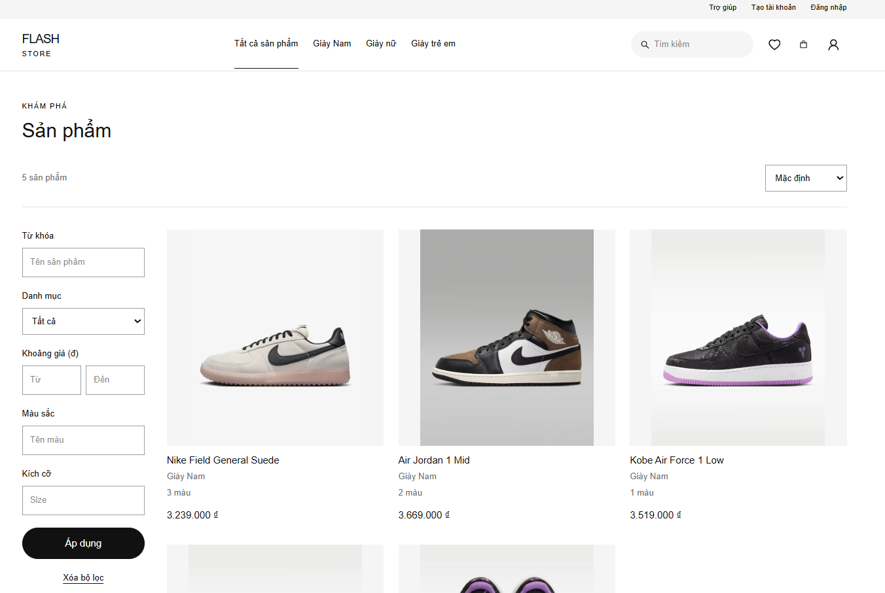
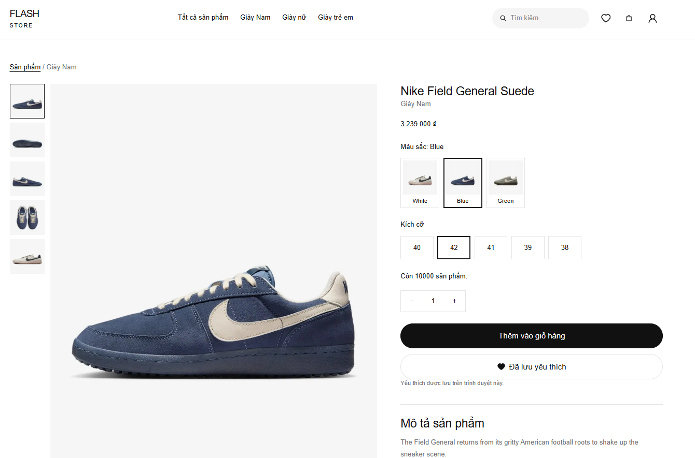
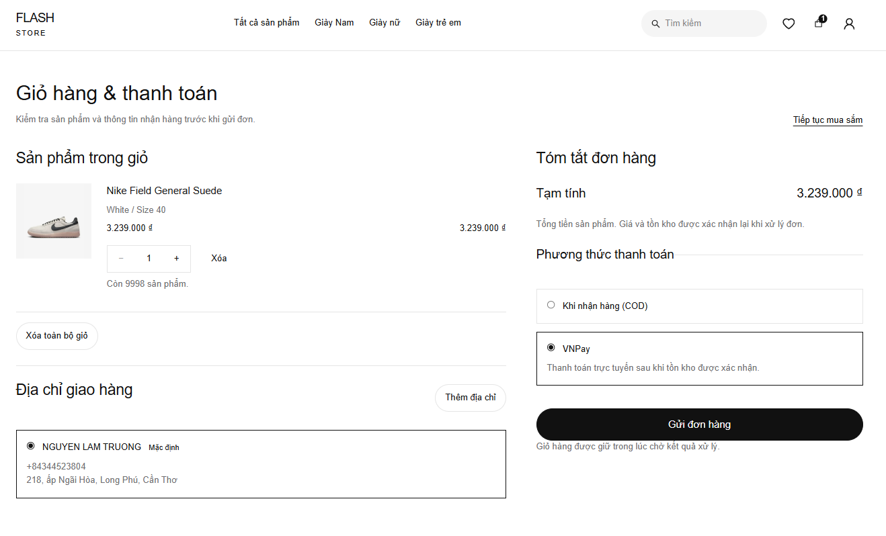
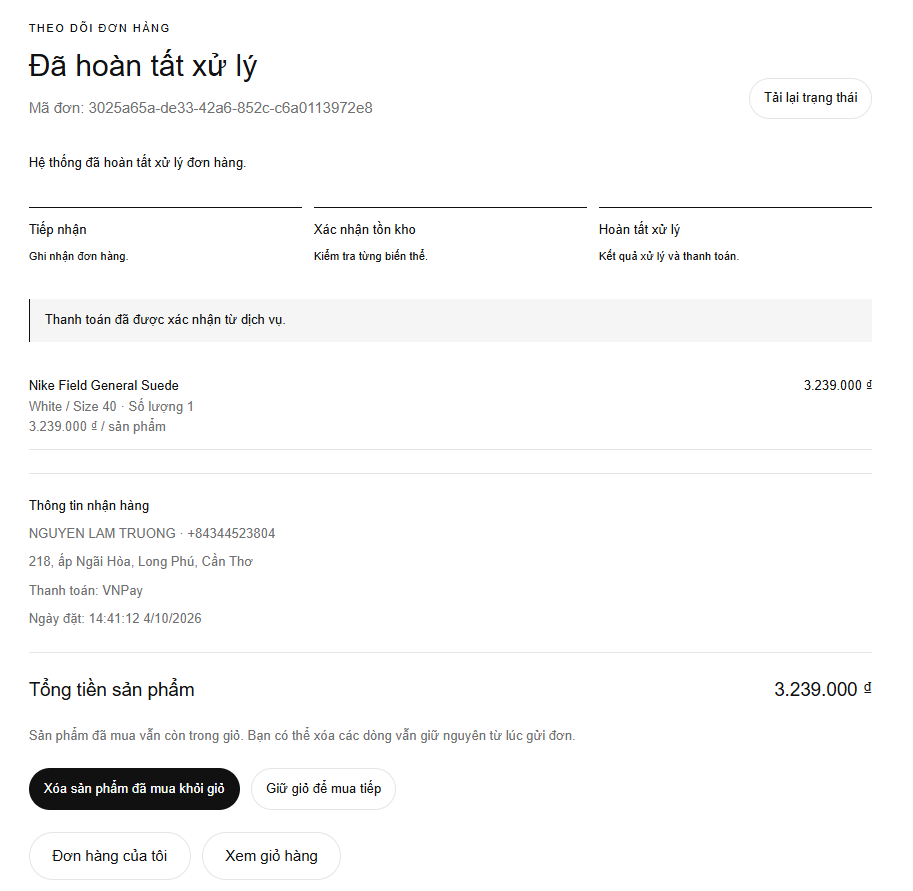
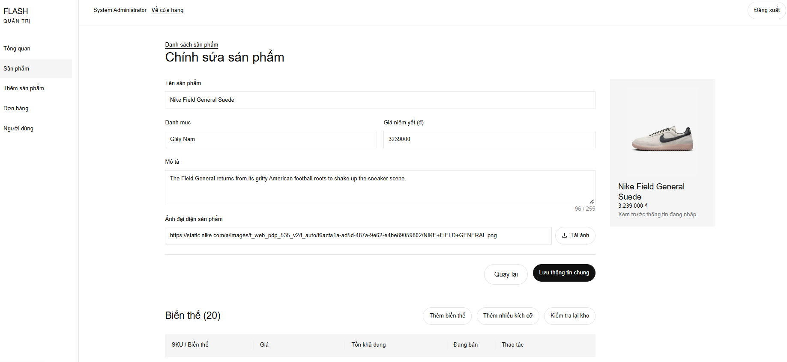
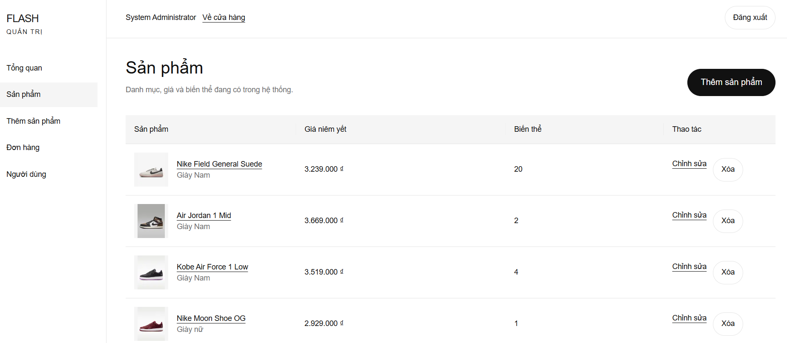
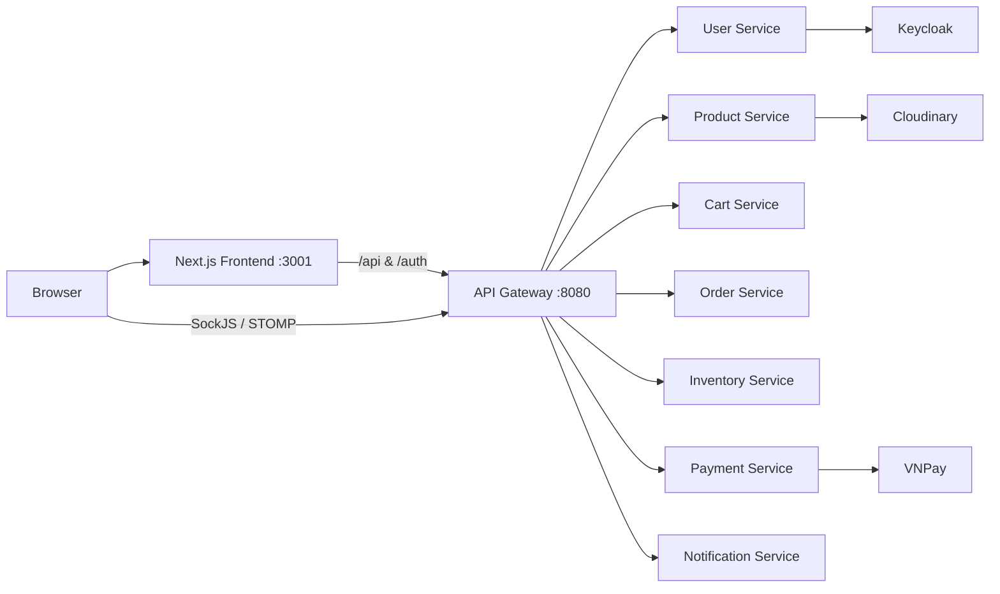

# Flash Store — Ecommerce Frontend

Frontend cho **Project 1 — Ecommerce Microservices**, xây dựng bằng Next.js và React. Ứng dụng hỗ trợ luồng mua hàng, quản trị catalog/inventory, theo dõi đơn bất đồng bộ và tích hợp với backend microservices qua API Gateway.

> **Trạng thái hiện tại:** production-oriented / production-hardened source & configuration. Chưa tuyên bố public production deployment hoặc live VNPay settlement.

- **Frontend repository:** `truongnguyen3006/ecommerce-frontend-1-`
- **Backend repository:** [ecommerce-backend-1-](https://github.com/truongnguyen3006/ecommerce-backend-1-)
- **Working branch:** `production-ready-final`
- **Local frontend:** `http://localhost:3001`
- **Local API Gateway:** `http://localhost:8080`

---

## Overview

Flash Store là giao diện cho hệ thống ecommerce theo kiến trúc microservices. Frontend không giả lập business state trong production flow: catalog, stock, cart, order, payment và user state đều lấy từ backend thật.

Các điểm chính:

- Catalog thật với search, filter, sort và pagination phía server.
- Product detail theo variant/SKU, màu, size, gallery và tồn kho.
- Đăng ký, đăng nhập, refresh token, logout và profile.
- CRUD địa chỉ với invariant một default address cho mỗi user.
- Cart theo tài khoản, cart-line revision và atomic purchased-cart cleanup.
- Checkout với COD hoặc VNPay.
- Idempotency cho order placement và admin stock adjustment.
- Order tracking bằng authenticated STOMP + bounded polling fallback.
- Payment state hiển thị theo backend authoritative state, không suy đoán từ query string.
- Admin product/variant management, Cloudinary upload, inventory adjustment, order và user management.
- Stable domain error codes và UI message mapping.
- Responsive behavior cho desktop, tablet và mobile.

---

## Screenshots

> Phần này đã chừa sẵn vị trí để thêm ảnh.  
> Gợi ý tạo thư mục `docs/images/`, đặt ảnh theo tên bên dưới rồi bỏ dấu comment của dòng Markdown tương ứng.

### Home & Product Catalog

<!-- Add screenshot: docs/images/home-catalog.png -->
<!--  -->

**Nên chụp:** trang Home hoặc Product Listing có header, category, filter/sort và product cards.

---

### Product Detail

<!-- Add screenshot: docs/images/product-detail.png -->
<!--  -->

**Nên chụp:** product gallery, variant/color/size selector, price, stock và nút Add to Cart.

---

### Cart & Checkout

<!-- Add screenshot: docs/images/cart-checkout.png -->
<!--  -->

**Nên chụp:** cart items + quantity hoặc màn hình checkout có địa chỉ và COD/VNPay.

---

### Order Tracking / Order History

<!-- Add screenshot: docs/images/order-tracking.png -->
<!--  -->

**Nên chụp:** order status, payment status, retry/reconciliation state hoặc order history.

---

### Admin — Product Management

<!-- Add screenshot: docs/images/admin-product.png -->
<!--  -->

**Nên chụp:** màn hình tạo/sửa product, variants, gallery hoặc Cloudinary upload.

---

### Admin — Inventory

<!-- Add screenshot: docs/images/admin-inventory.png -->
<!--  -->

**Nên chụp:** stock adjustment, operation status hoặc inventory table.

---

### Responsive Mobile

<!-- Add screenshot: docs/images/mobile.png -->
<!--  -->

**Nên chụp:** product listing hoặc checkout ở viewport mobile.

---

## Architecture


```mermaid
flowchart LR
    B[Browser] --> N[Next.js Frontend :3001]
    N -->|/api & /auth| G[API Gateway :8080]
    B -->|SockJS / STOMP| G

    G --> U[User Service]
    G --> P[Product Service]
    G --> C[Cart Service]
    G --> O[Order Service]
    G --> I[Inventory Service]
    G --> PAY[Payment Service]
    G --> NOTI[Notification Service]

    U --> K[Keycloak]
    P --> CL[Cloudinary]
    PAY --> V[VNPay]
```

Frontend dùng cùng-origin API routes cho `/api` và `/auth`. WebSocket/SockJS sử dụng `NEXT_PUBLIC_WS_URL` và được xác thực bằng bearer token.

---

## Tech Stack

| Area | Technology |
|---|---|
| Framework | Next.js 16.3.8 |
| UI runtime | React 19.2.8 |
| Language | TypeScript 5 |
| Styling | Tailwind CSS 4 |
| Component library | Ant Design 5 |
| Server state | TanStack React Query 5 |
| Client state | Zustand 5 |
| HTTP | Axios 1.20 |
| Realtime | SockJS + STOMP |
| Testing | Playwright |
| Container | Standalone Next.js Docker image |

---

## Important Frontend Behaviors

### Authentication

- Access token được gắn vào authenticated API client.
- Auth endpoints dùng transport riêng để tránh recursive refresh.
- Concurrent authenticated reads dùng chung một refresh coordinator.
- Invalid/expired refresh token làm clear session an toàn.
- Transient Keycloak/provider failure không bị hiển thị sai thành “wrong password”.
- Mutation không được tự động replay sau refresh.

### Cart

- Cart thuộc về authenticated owner.
- Mỗi cart line có revision.
- Purchased-line cleanup kiểm tra SKU + quantity + revision.
- Dòng mới hoặc đã thay đổi sau checkout không bị xóa nhầm.

### Order & Payment

- Order placement dùng idempotency key.
- HTTP 202 chỉ là accepted/processing acknowledgment, không phải completion.
- Browser VNPay Return không được xem là bằng chứng thanh toán.
- Payment status lấy từ backend.
- Expired/unresolved VNPay attempt chuyển sang trạng thái reconciliation thay vì tự tạo payment mới không an toàn.
- Cancellation chịu payment fence để tránh paid + cancelled + restored-stock inconsistency.

### Admin Inventory

- Stock adjustment dùng stable operation ID/idempotency key.
- UI phân biệt `ACCEPTED/PENDING/APPLIED/REJECTED`.
- Retry cùng logical operation không được double-adjust stock.

---

## Local Setup

### Requirements

- Node.js **20.9+**
- npm
- Backend Project 1 đang chạy
- API Gateway tại port **8080**

Clone đúng branch hiện tại:

```bash
git clone --branch production-ready-final https://github.com/truongnguyen3006/ecommerce-frontend-1-.git
cd ecommerce-frontend-1-
npm ci
```

Tạo file `.env.local`:

```dotenv
API_URL=http://localhost:8080
NEXT_PUBLIC_WS_URL=http://localhost:8080/ws
```

Sau đó:

```bash
npm run dev
```

Mở:

```text
http://localhost:3001
```

### Environment Notes

- Browser gọi `/api` và `/auth` qua Next.js tới `API_URL`.
- SockJS dùng `NEXT_PUBLIC_WS_URL` trực tiếp.
- Biến `NEXT_PUBLIC_*` được đưa vào client bundle lúc build, vì vậy đổi biến môi trường cần restart/rebuild.
- Không đặt Keycloak client secret, Cloudinary secret hoặc VNPay HashSecret trong frontend.
- `.env.local` không được commit.

---

## Production Build

```bash
npm ci
npm run lint
npm run build
npm run start
```

Frontend production sử dụng standalone Next.js container và đã được validate trong CI.

---

## Testing

Chạy toàn bộ:

```bash
npm ci
npm run lint
npm run build
npx playwright install chromium
npm test
```

Hoặc chạy riêng:

```bash
npm run test:unit
npm run test:e2e
npm run test:responsive
```

Checkpoint cuối của `production-ready-final`:

| Suite | Result |
|---|---:|
| Unit | 20 passed |
| Flow | 54 passed |
| Responsive | 5 passed |
| **Total** | **79 passed** |
| Lint | PASS |
| Build | PASS |
| Standalone image health | PASS |

Flow tests gồm desktop và mobile. Responsive checks bao phủ nhiều viewport từ mobile đến desktop.

---

## Suggested Local Smoke Test

Sau khi frontend + backend chạy:

1. Register/Login USER.
2. Mở catalog, search/filter/sort.
3. Mở product detail và chọn SKU còn stock.
4. Add to Cart và thay đổi quantity.
5. Checkout COD.
6. Kiểm tra Order History/Detail.
7. Test VNPay Sandbox bằng một **order mới**.
8. Login ADMIN và thử product edit + Cloudinary upload.
9. Thử inventory adjustment và xem final operation status.
10. Xác nhận USER không truy cập được admin routes và user A không xem được dữ liệu riêng của user B.

---

## VNPay & Cloudinary

### Cloudinary

Image upload được thực hiện qua backend Product Service. Frontend không giữ API secret.

### VNPay

Frontend chỉ điều hướng tới payment URL do backend trả về và đọc payment/order state từ API.

Live VNPay Sandbox settlement **chưa được tuyên bố verified** trong repository hiện tại. Khi test sandbox, sử dụng merchant credentials ở backend và không commit hoặc đưa HashSecret vào frontend/log/screenshot.

---

## Production-Oriented Hardening

Project đã có frontend-side support cho:

- stable API/domain errors;
- auth refresh coordination;
- account-aware cache/session behavior;
- optimistic product revision conflicts;
- idempotent checkout;
- atomic cart cleanup contract;
- VNPay attempt expiry/reconciliation UI;
- read-only Return behavior;
- inventory operation identity/status;
- authenticated order tracking;
- responsive UI regression tests;
- standalone production Docker image;
- CI build/test/image health validation.

Điều này không đồng nghĩa hệ thống đã được chứng nhận public production. Domain/TLS, live provider verification, real owner environment, dependency/security triage và deployment vẫn là các bước riêng.

---

## Related Documentation

- [API Contract](docs/API_CONTRACT.md)
- [Batch 6 Validation](docs/BATCH6_VALIDATION.md)
- [Deployment Guide](DEPLOYMENT.md)
- [Backend Repository](https://github.com/truongnguyen3006/ecommerce-backend-1-)

---

## Project Status

```text
Frontend source hardening       PASS
Frontend automated tests        PASS (79)
Production build                PASS
Standalone container health     PASS
Backend disposable runtime      PASS
Public deployment               NOT DONE
Live VNPay settlement           NOT VERIFIED
```

---

## Author

**Nguyễn Lâm Trường**

- GitHub: [truongnguyen3006](https://github.com/truongnguyen3006)
- Backend: [ecommerce-backend-1-](https://github.com/truongnguyen3006/ecommerce-backend-1-)
- Frontend: [ecommerce-frontend-1-](https://github.com/truongnguyen3006/ecommerce-frontend-1-)
